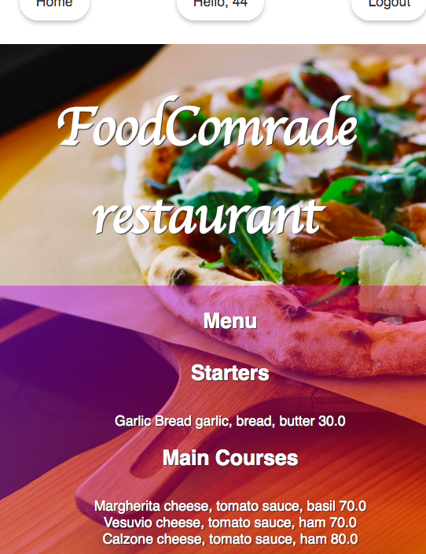

# The slowfood challenge
### Authors  
[Clarissa Liljander](https://github.com/clalil)   
[Pia von Wachenfelt](https://github.com/piavW)  
[Jonas Masharqa](https://github.com/tazzex7)  
[David Izosimov](https://github.com/DavveDavve)  
[Yasmine Ezequiel](https://github.com/yasmineezequiel)  
## Built with  
**Front End:** Rails, CSS  
**Back End:** Rails  
**Testing frameworks:** Cucumber, RSpec  
**Deployed at:** -  
**Project Management Tool:** [Pivotal tracker for our team](https://www.pivotaltracker.com/n/projects/2401272)



## The code   
This repository contains our team's solution to the Slow Food Challenge; a web-based application (an Online Food Ordering System) that allows customers to order their food for home delivery, or for pick up from the restaurant. Our imaginary client is a restaurant owner that needs a website where he can list his menu and allow visitors to place orders. This was a one week challenge using Ruby on Rails as well as the gems [Devise](https://github.com/plataformatec/devise) (for login and sign up functionality) and [Cartify](https://github.com/CraftAcademy/cartify) (for purchase order options).   

## Getting started
### Dependencies  
* Rails v. 5.2.0
* Postgresql
* Bundler

### Setup   
To test this application you need to fork it to your own GitHub account and clone it to your local workspace. After that, you should run the following commands in your terminal:   
 
```
$ bundle
$ rails db:create
$ rails db:migrate
$ rails db:seed
```  
If you have issues with the migrations, you might have to update your current version of bundle to version 2.0.2.  

To run the feature and unit tests:  
```
$ rake
```
To start the application and run it on your local host:
```
$ rails server
```

## Updates/Improvements  
Currently the Cartify functionality is not fully implemented, hence a user will not be able to make a complete transaction.   

## License  
This project is under the [MIT-license](https://en.wikipedia.org/wiki/MIT_License).

### Acknowledgement  
Thank you [Craft Academy](https://craftacademy.se) for giving us this assignment.  
